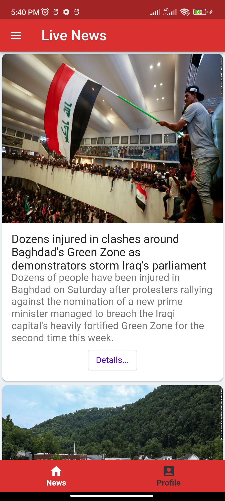
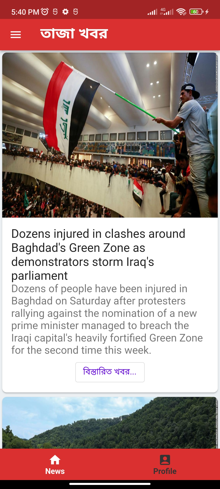
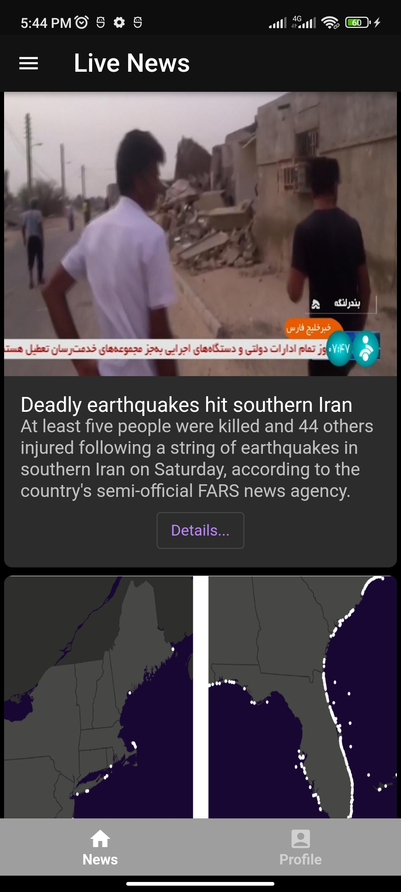
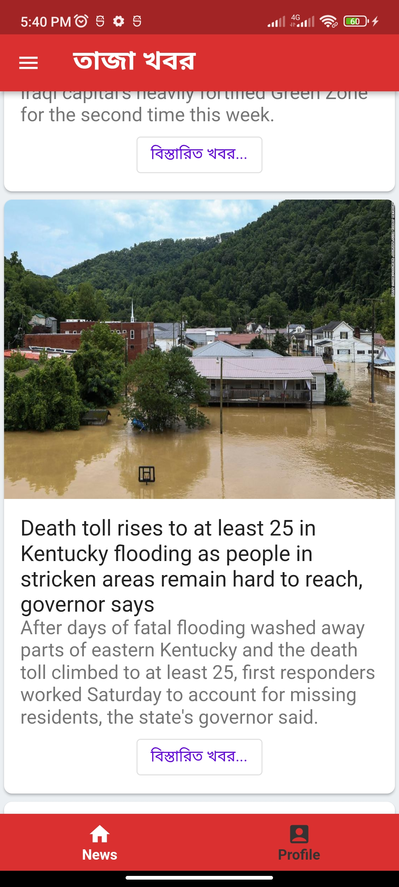

# Live News App Flutter

A flutter app the fetches live news from server, store and shows.  
It has authentication feature with dynamic domain generation.

      

### Topics covered
* Modularizing architechure layer with flutter [package](https://docs.flutter.dev/development/packages-and-plugins/using-packages)
* [Bloc](https://bloclibrary.dev/#/) library for state management and architecting app with [VGV architecture](https://verygood.ventures/blog/very-good-flutter-architecture)
* [Hydrated bloc/cubit](https://github.com/felangel/bloc/tree/master/packages/hydrated_bloc) for state management with persisted state/data
* [Google map](https://pub.dev/packages/google_maps_flutter)
* [Multi language/locale support](https://docs.flutter.dev/development/accessibility-and-localization/internationalization)
* [Material theme](https://docs.flutter.dev/cookbook/design/themes) with dark and light mode
* Popular [dio](https://github.com/flutterchina/dio) package for http service

### App Features                                                                                                                                              
   * User sign up option with their username and password
   * Automatic domain generation under the hood while on sign up process
   * User login up option with their username and password
   * Upon authentication successful, users can see a news page, where live news is available from third party service. Also users can refresh the news page with the latest data.
   * Offline support and synchronization
   * MultiLanguage support for English and Bengali, can be added to more languages/locales
   * Material theming with light and dark mode change option.
   * Proper handling of edge cases                                                                                                                       
                                                                                                                                                  
### App Architecture summary
- Used clean architecture for structuring the app.
- There are three layers in the app

    * Application/Feature layer (where user interacts, app UI and widget, where bloc resides and handles business logic)
    * Domain layer (where generate business value, aggregate data from data layer and provide data to business layer.
    * Data layer (where raw data is generated from various sources like remote and local sources.

Followed separation of concerns in terms of organizing the code.
Separation of concern brings below benefits:

    - Ease of refactoring
    - Ease of testing
    - Reusability of code

The first two layers reside in the main app. For the other two layers, two separate packages have been created for.

     1. main app - Application/Feature layer
     2. mail_repository - Domain layer
     3. mail_tm_api  - Data Layer                                                                                                                                                                                                                                                                                              
                                                                                                                                                  
                                                                                                                                                  
### Installation

If you're new to Flutter the first thing you'll need is to follow the [setup instructions](https://flutter.dev/docs/get-started/install). 

Once Flutter is setup, you can use the latest `stable` channel:
 * Run `flutter channel stable`
 * Run `flutter upgrade`

Once you're on `master` branch, you're ready to run the app:
* `flutter run -d android`
* `flutter run -d ios`
* `flutter run -d web`                                                                                                                                              

### API Key
This repo includes a free api for fetching live news. In order to run the app generate an api on your own and replace `baseUrlNews` in the `base_client.dart` file.

### License

This application is released under the [MIT license](LICENSE.md). You can use the code for any purpose, including commercial projects.

